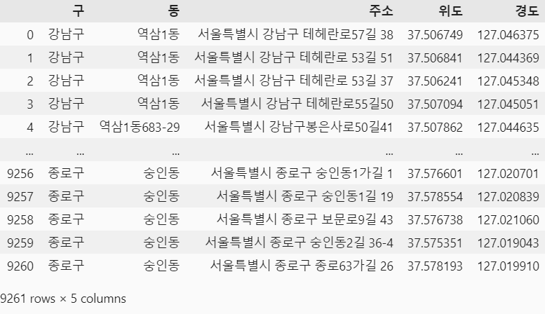
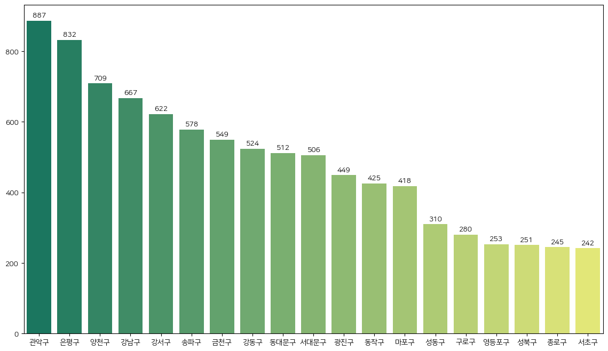
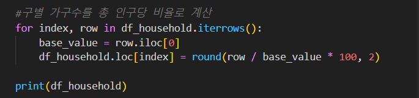
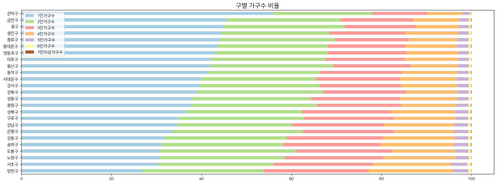
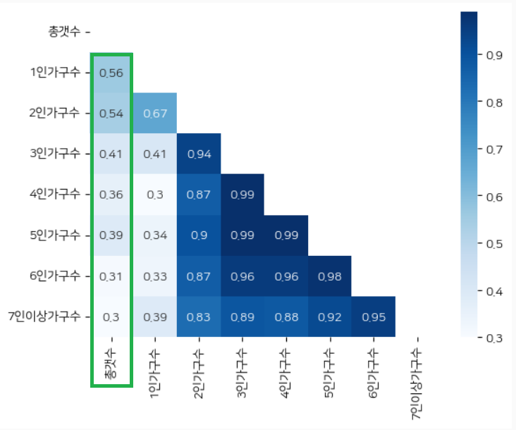
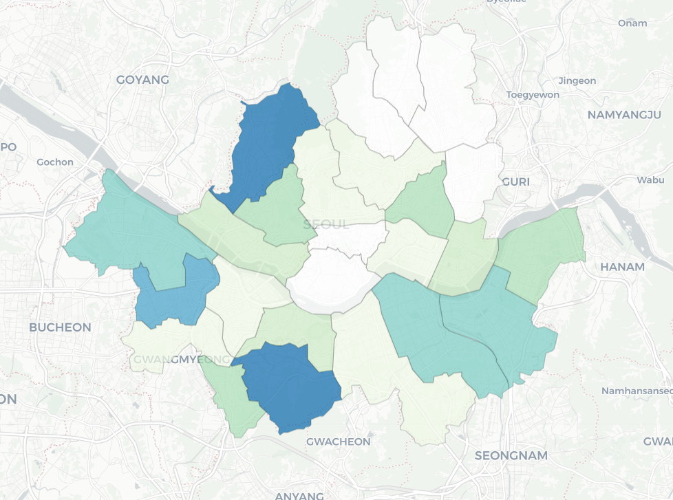

# Side Project1 - Data Engeineering And Analysis

## 1. 프로젝트 개요
### 🧦프로젝트명 : 서울시 의류수거함 공공데이터를 활용한 데이터 분석
### 프로젝트 목적 : 
평소에 동네에 있는 의류수거함을 자주 이용했었는데 얼마 전에 집앞에 있던 의류수거함이 없어졌고, 대체할 만한 곳이 어디에 있을지 찾을 수 있는 방법이 없어서 불편함을 느꼈습니다.
**주변에 흩어져 있는 의류수거함의 위치를 한눈에 볼 수 있고, 의류수거함의 수가 가구원수와 유의미한 관계성이 있을지 알아보기 위해 이 프로젝트를 진행하였습니다.**
## 2. 사용 기술 및 데이터 출처
1. 데이터 전처리 : Python, Pandas, Geopy
2. 데이터 시각화 : Python, Matplotlib, Seaborn, Folium
3. 데이터 출처 :  
공공데이터포털 - 서울시 19개구 의류수거함 정보 데이터 (6개구는 데이터 없음.) 
서울 열린데이터 광장 - 서울시 가구원수별 가구수(구별) 통계
## 3. 프로젝트 설명
### 1. 데이터 수집 및 전처리
  각 구의 데이터를 모아 Pandas를 활용하여 칼럼을 통일시키고 서울시 전체로 통합하였습니다.

  - 지번주소와 도로명주소 둘 다 있는 경우, 지번주소 칼럼 삭제
  - 분석에 필요없는 칼럼 삭제
  - 구별로 칼럼명을 다르게 기록했을 경우, 통일성을 위해 칼럼명 변경
  - 필요한 칼럼이 없을 경우, 존재하는 데이터를 활용하여 원하는 칼럼 생성
    
    
  ](image/image-1.png)
   
  - Geopy 라이브러리를 활용하여 도로명주소로 경도, 위도를 추출
  - 최종적으로 [구, 동, 주소, 위도, 경도]로 칼럼명 통일
      

### 2. 데이터 시각화
#### **1. 의류수거함이 가장 많은 자치구는 어디일까?**

서울시 전체 데이터에서 구별로 분류하여 갯수를 집계하였습니다.  

>💡의류수거함이 가장 많은 곳 : 관악구, 은평구, 양천구, 강남구, 송파구

 

#### **2. 자치구별로 가구수 알아보기**

인구수에 따라 가구수의 인구수도 달라지기 때문에, 각 자치구 별로 총 인구 대비 가구수 인구을 비율로 계산하였습니다.  

>💡1, 2인가구 비율이 높은 곳: 관악구, 중구, 금천구, 종로구, 용산구   
💡3, 4인가구 비율이 높은 곳: 서대문구, 양천구, 서초구, 노원구, 송파구

 

#### **3. 가구수와 의류수거함의 갯수에는 상관관계가 있을까?**

>💡의류수거함의 총 갯수와 1인가구수는 0.56, 2인가구수는 0.54의 상관계수가 나타났습니다.  즉, 1,2인 가구가 많은 곳은 의류수거함이 많을 수 있다는 관계성이 있다고 할 수 있습니다. 

 

**4.결론**
>💡1, 2인 가구가 많이 사는 곳에는 의류수거함이 많이 분포되어 있을 수 있다는 점을 알 수 있었습니다. 
서울시에서 1,2인 가구 비율이 높은 Top5 자치구 중에서 종로구와 금천구는 보유하고 있는 의류수거함이 적은 편이라 보충이 필요할 것으로 보입니다.

 

### 3. 지도 시각화
folium 을 활용하여 의류수거함 갯수가 많은 곳과 적은 곳을 한눈에 볼 수 있도록 시각화하였습니다.
색상이 진할수록 갯수가 많은 자치구이고, 데이터 부재인 곳은 흰색으로 표현했습니다.  

 
## 4. 느낀 점
**1. 위치 정보 서비스에서의 최신데이터의 필요성**  

각 자치구별로 데이터를 업로드해준 시기가 상이했습니다. 가능한 최신의 데이터를 수집하려고 했으나, 모든 자치구의 데이터를 가장 최신의 데이터로 가져오지는 못하여 이 프로젝트의 결과가 현재의 상황을 보여주지는 못한다는 아쉬움이 있습니다.
위치, 분포, 지도 정보 서비스에서는 최신데이터, 실시간 데이터가 매우 중요하다는 것을 느끼게 되었습니다.  

**2. 실생활에서 데이터 분석을 통해 유의미한 결과 도출**  

주변의 현상을 보고 호기심으로 시작해본 프로젝트였는데, 데이터를 직접 분석해보고 유의미한 결과를 끌어내는 것이 재미있었습니다. 
설치된 의류수거함의 갯수는 각 자치구별로 정책이 다르고, 다양한 요소들이 영향을 끼치기 때문에 달라질 수 있지만, 가구수가 조금의 영향을 주는 요소가 될 수도 있다는 것을 발견하여 뿌듯함을 느꼈습니다.
